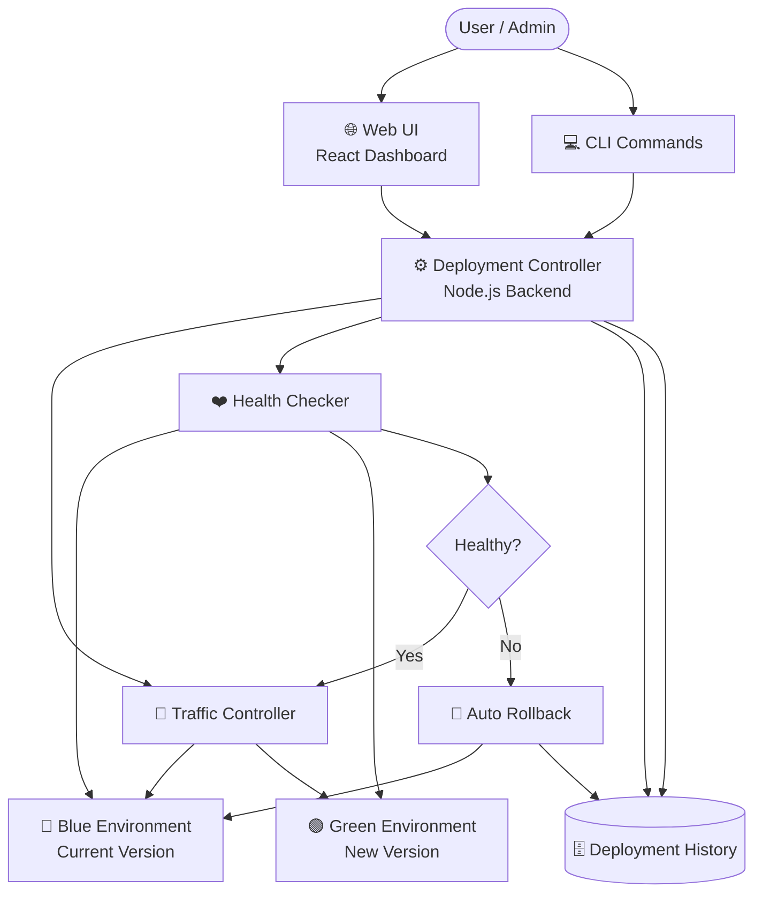

```mermaid 
 flowchart TD

    User([User / Admin])

    UI[🌐 Web UI<br/>React Dashboard]
    CLI[💻 CLI Commands]

    User --> UI
    User --> CLI

    UI --> API
    CLI --> API

    API[⚙️ Deployment Controller<br/>Node.js Backend]

    API --> Traffic
    API --> Health
    API --> History

    Traffic[🚦 Traffic Controller]

    Traffic --> Blue
    Traffic --> Green

    Blue[🔵 Blue Environment<br/>Current Version]

    Green[🟢 Green Environment<br/>New Version]

    Health[❤️ Health Checker]

    Health --> Blue
    Health --> Green

    Health --> Decision{Healthy?}

    Decision -->|Yes| Traffic

    Decision -->|No| Rollback[🔄 Auto Rollback]

    Rollback --> Blue

    History[(🗄️ Deployment History)]

    API --> History
    Rollback --> History 
```
